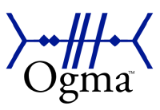

<!---
  PyAOgmaNeo Documentation
  Copyright(c) 2020-2025 Ogma Intelligent Systems Corp. All rights reserved.
--->

# PyAOgmaNeo Documentation

<div align="center">
  
  <p><strong>Python bindings for the AOgmaNeo library</strong></p>
  <p>
    <a href="https://github.com/ogmacorp/PyAOgmaNeo">PyAOgmaNeo</a> •
    <a href="https://github.com/ogmacorp/AOgmaNeo">AOgmaNeo</a> •
    <a href="https://github.com/ogmacorp/CLOgmaNeo">CLOgmaNeo</a> •
    <a href="docs/getting_started/installation.md">Installation</a> •
    <a href="docs/getting_started/quickstart.md">Quickstart</a> •
    <a href="docs/examples">Examples</a>
  </p>
</div>

## Documentation Status

| Symbol | Meaning |
|:------:|---------|
| ✅ | Complete (exists in this repository with full documentation) |
| 🔄 | In Progress |
| 📝 | Draft Available |
| ⚠️ | Exists in PyAOgmaNeo (needs to be transferred and expanded) |
| ⏳ | Not Started |

## Quick Access

| Task | Documentation |
|------|--------------|
| Quick start guide | [Quickstart Guide](docs/getting_started/quickstart.md) |
| Learn fundamentals | [Basic Concepts](docs/getting_started/basic_concepts.md) |
| Browse examples | [Examples](docs/examples) |
| Understand internals | [Core Concepts](docs/user_guide/core_concepts.md) |
| Follow tutorials | [Tutorials](docs/tutorials/basic/first_hierarchy.md) |
| API documentation | [API Reference](docs/api_reference/index.md) |
| Contribute code | [Contributing Guide](docs/contributing/guidelines.md) |

## Latest Documentation Updates

| Date | Section | Description |
|------|---------|-------------|
| 2025-07-29 | [Quickstart Guide](docs/getting_started/quickstart.md) | Complete quickstart guide with runnable examples and core concepts ✅ |
| 2025-07-23 | [API Reference](docs/api_reference/index.md) | Complete API documentation with verified methods and examples ✅ |
| 2025-07-23 | [Layer Configuration](docs/api_reference/layer_config.md) | Comprehensive layer configuration guide with parameter validation ✅ |
| 2025-07-23 | [State Management](docs/api_reference/state_management.md) | Detailed state management documentation with verified examples ✅ |
| 2025-07-23 | [Image Processing](docs/api_reference/image_encoder.md) | Complete ImageEncoder documentation with usage patterns ✅ |
| 2025-07-22 | [Fashion MNIST Classification](docs/examples/fashion_mnist/fashion_mnist.md) | Added complete example of classification ✅ |

## Documentation Overview

This documentation is organized into several sections to help you find what you need:

### Learning Path

<details open>
<summary><b>Getting Started</b> ⚠️</summary>

- [Installation](docs/getting_started/installation.md) ⚠️
- [Quickstart](docs/getting_started/quickstart.md) ✅
- [Basic Concepts](docs/getting_started/basic_concepts.md) ⏳
</details>

<details open>
<summary><b>User Guide</b> ⏳</summary>

- [Overview](docs/user_guide/overview.md) ⏳
- [Core Concepts](docs/user_guide/core_concepts.md) ⏳
- [EnvRunner Guide](docs/user_guide/env_runner.md) ⚠️
- [Custom Environments](docs/user_guide/custom_environments.md) ⏳
</details>

<details open>
<summary><b>Tutorials</b> ⏳</summary>

- **Basic** ⏳
  - [First Hierarchy](docs/tutorials/basic/first_hierarchy.md) ⏳
  - [Simple Prediction](docs/tutorials/basic/simple_prediction.md) ⏳
- **Advanced** ⏳
  - [Custom Encoders](docs/tutorials/advanced/custom_encoders.md) ⏳
  - [Optimization](docs/tutorials/advanced/optimization.md) ⏳
</details>

### Reference Material

<details open>
<summary><b>Technical Documentation</b> 🔄</summary>

- [Parameter Tuning](docs/technical_guide/parameter_tuning.md) 🔄
- [Core Concepts](docs/technical_guide/core_concepts.md) ⏳
  - CSDR Format
  - Core Data Structures
- [Advanced Topics](docs/technical_guide/advanced_topics.md) ⏳
</details>

<details open>
<summary><b>API Reference</b> ⏳</summary>

- [Overview](docs/api_reference/index.md) ⏳
- [Hierarchy Class](docs/api_reference/hierarchy.md) ⏳
  - Core Methods
  - Serialization Methods
  - State Management
  - Prediction Methods
  - Reconstruction Methods
- [LayerDesc Class](docs/api_reference/layer_desc.md) ⏳
- [IODesc Class](docs/api_reference/io_desc.md) ⏳
</details>

### Examples and Use Cases

<details open>
<summary><b>View all examples</b> ⚠️</summary>

- **CartPole** ⚠️
  - [Manual Implementation](docs/examples/cartpole/manual_implementation.md) ⚠️
  - [EnvRunner Implementation](docs/examples/cartpole/env_runner_implementation.md) ⚠️
- **Natural Language Processing** ⏳
  - [Text Prediction](docs/examples/nlp/text_prediction.md) ⏳
- **Classification** ✅
  - [Fashion MNIST Classification](docs/examples/fashion_mnist/fashion_mnist.md) ✅
- **Other Examples** ⚠️
  - [Wave Prediction](docs/examples/wave_prediction.md) ⚠️
  - [Lunar Lander](docs/examples/lunar_lander.md) ⚠️
</details>

### Additional Resources

<details open>
<summary><b>View all resources</b> 🔄</summary>

- [Contributing Guidelines](docs/contributing/guidelines.md) ✅
- [Development Setup](docs/contributing/development_setup.md) ⏳
- [Documentation Guide](docs/contributing/documentation.md) ⏳
- [Naming Reference](docs/appendix/naming_reference.md) 🔄
</details>

<details open>
<summary><b>Appendix</b> 🔄</summary>

- [Naming Reference](docs/appendix/naming_reference.md) 🔄 _(Transferred from AOgmaNeo)_
</details>

---

### Next Steps

> More of a TODO list: will keep it updated

1. **Transfer existing content from PyAOgmaNeo:**
   - Installation guide
   - EnvRunner documentation
   - Example code and explanations
    
2. **Begin with high-priority sections:**
   - ✅ Complete quickstart guide
   - Basic concepts documentation
   - API reference overview

3. **Expand tutorials and examples:**
   - First hierarchy tutorial
   - Text prediction example
   - Additional use cases

## Documentation Repository Structure

<details open>
<summary>View complete documentation structure</summary>

```
docs/
├── getting_started/
│   ├── installation.md         # Installation instructions
│   ├── quickstart.md          # Quick introduction and first steps
│   └── basic_concepts.md      # Essential concepts to get started
│
├── user_guide/
│   ├── overview.md            # High-level overview of PyAOgmaNeo
│   ├── core_concepts.md       # Detailed explanation of core concepts
│   ├── env_runner.md          # Guide to using EnvRunner
│   └── custom_environments.md # Creating custom environments
│
├── technical_guide/
│   ├── parameter_tuning.md    # Comprehensive parameter tuning guide
│   └── core_concepts.md       # Technical details of SPH architecture
│
├── api_reference/
│   ├── index.md               # API documentation overview
│   ├── hierarchy.md           # Hierarchy class reference
│   ├── layer_config.md        # Layer configuration reference
│   ├── state_management.md    # State management guide
│   └── image_encoder.md       # Image processing reference
│
├── tutorials/
│   ├── basic/
│   │   ├── first_hierarchy.md     # Creating your first hierarchy
│   │   └── simple_prediction.md   # Basic prediction example
│   └── advanced/
│       ├── custom_encoders.md     # Working with custom encoders
│       └── optimization.md        # Performance optimization
│
├── examples/
│   ├── cartpole/
│   │   ├── manual_implementation.md
│   │   └── env_runner_implementation.md
│   ├── fashion_mnist/
│   │   ├── fashion_mnist.md       # Fashion MNIST classification guide
│   │   └── fashion_mnist_tutorial.ipynb  # Example implementation
│   ├── nlp/
│   │   └── text_prediction.md    # Text prediction example
│   ├── wave_prediction.md
│   └── lunar_lander.md
│
├── appendix/
│   └── naming_reference.md    # Variable naming conventions and reference
│
└── contributing/
    ├── guidelines.md         # Contribution guidelines
    ├── development_setup.md  # Setting up development environment
    └── documentation.md      # Documentation contribution guide
```
</details>

## License

<a rel="license" href="http://creativecommons.org/licenses/by-nc-sa/4.0/"></a>

This documentation is licensed under the [Creative Commons Attribution-NonCommercial-ShareAlike 4.0 International License](http://creativecommons.org/licenses/by-nc-sa/4.0/).

Contact Ogma via licenses@ogmacorp.com to discuss commercial use and licensing options.

PyAOgmaNeo Copyright (c) 2020-2025 [Ogma Intelligent Systems Corp](https://ogmacorp.com). All rights reserved. 